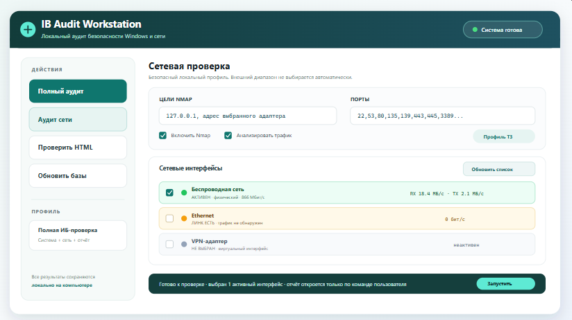
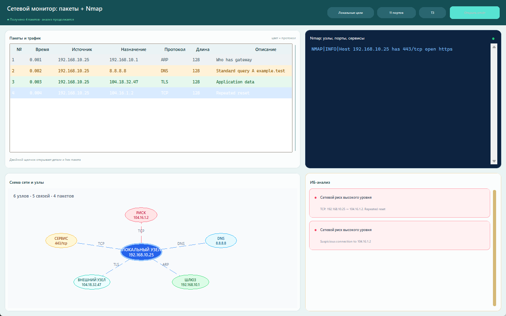
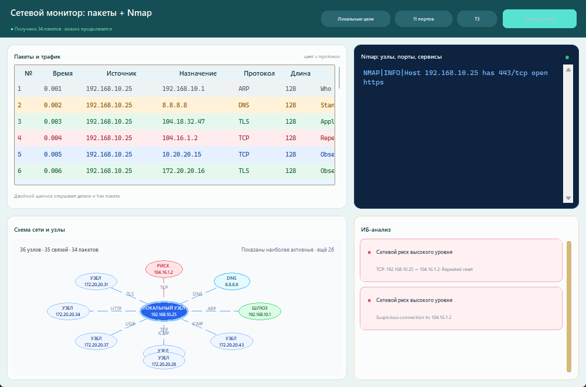
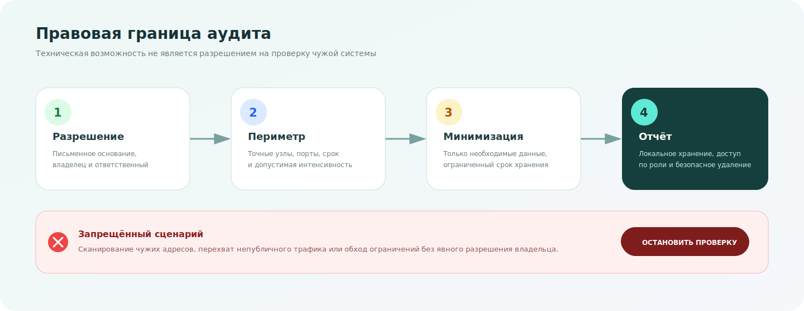

# IB Audit Workstation Network Edition

Локальная read-only рабочая станция для аудита Windows, анализа HTML-отчётов WinAudit/IB Audit Workstation, проверки известных уязвимостей по открытым источникам и опционального анализа сетевых коммуникаций через Nmap/tshark. Приложение не меняет настройки системы: оно собирает инвентаризацию, нормализует данные, применяет правила проверки, сопоставляет объекты с CISA KEV/NVD/ФСТЭК БДУ и формирует автономные HTML-отчёты.

Разработал: Абдрахманов Амаль Даулетович.

Версия без сетевого сканирования находится в отдельном репозитории: [Amtonsi/ib-audit-workstation](https://github.com/Amtonsi/ib-audit-workstation).

> Все картинки в README используют синтетические тестовые данные. В них нет реальных имён компьютеров, пользователей, IP-адресов, путей, журналов событий или результатов аудита.

[Скачать PDF-инструкцию с подробными схемами](docs/IBAuditWorkstation_UserGuide_RU.pdf)



## Что умеет приложение

- выполняет локальный аудит одной Windows-машины;
- импортирует один или несколько HTML-отчётов WinAudit/IB Audit Workstation;
- формирует один сводный HTML-отчёт по нескольким документам;
- показывает прогресс выполнения и позволяет отменить текущую проверку;
- запускает отдельный аудит сети с Nmap и захватом трафика через встроенный tshark/Wireshark;
- показывает реальные пакеты, вывод Nmap, динамическую схему узлов и ИБ-события в одном окне;
- показывает в HTML-отчёте, какие приложения и сервисы с кем общаются, через какие порты и протоколы;
- проверяет настройки безопасности, службы, драйверы, автозапуск, задачи, пользователей, сетевые параметры, события, установленное ПО и другие категории инвентаризации;
- сопоставляет найденные объекты с CISA KEV, NVD CVE и ФСТЭК БДУ;
- хранит локальную историю аудитов в SQLite;
- генерирует автономные HTML-отчёты без внешних CSS/JS-ресурсов.

## Логика работы ПО


1. Пользователь запускает полный аудит компьютера или выбирает HTML-отчёты для проверки.
2. Коллекторы или HTML-импортёр превращают исходные данные в единый инвентарь объектов.
3. Диагностика фиксирует недоступные источники данных, ошибки парсинга и ограничения прав.
4. Rulepack применяет правила конфигурации и назначает каждому объекту статус:
   - `risk` — найден риск или нарушение;
   - `passed` — применимые правила пройдены;
   - `insufficient_data` — данных недостаточно для уверенного вывода;
   - `not_applicable` — к объекту нет применимых правил.
5. В режиме «Аудит сети» пользователь выбирает один или несколько автоматически обнаруженных интерфейсов и явно включает Nmap и/или захват.
6. Монитор показывает только реальные пакеты после старта tshark; узлы, связи, роли и цвета схемы рассчитываются из пакетов, результатов Nmap и ИБ-событий.
7. Модуль уязвимостей сопоставляет ПО, драйверы, службы, сетевые сервисы и другие применимые объекты с CISA KEV, NVD и ФСТЭК БДУ.
8. Результат сохраняется в локальную SQLite-базу и в HTML-отчёт.
9. Если пользователь нажимает «Отменить», проверка останавливается в ближайшей безопасной точке. Для пакетного HTML-анализа уже обработанные документы могут попасть в частичный отчёт.

## Главное окно


Основные элементы интерфейса:

- «Полный аудит» запускает локальный сбор инвентаризации;
- «Аудит сети» запускает только сетевые коллекторы и создаёт отдельный HTML-отчёт;
- «Проверить HTML-отчёты» открывает выбор одного или нескольких `.html`/`.htm` файлов;
- «Обновить базы» сначала ищет `vulnerability_sources.db` в папке проекта и подпапках, затем инкрементально обновляет найденную БД: переиспользует уже индексированные feed-файлы и активную CPE-генерацию, докачивая только актуальные или отсутствующие источники CISA/NVD/CPE;
- «Отменить» отправляет сигнал остановки активной операции;
- блок «Сетевые интерфейсы» автоматически показывает адаптеры, RX/TX-активность, тип интерфейса и отдельный чекбокс выбора;
- зелёная строка означает активный трафик, янтарная - физический линк без данных, серая - неактивный или виртуальный интерфейс;
- нижняя командная панель показывает готовность и запускает проверку только по команде пользователя;
- нижняя подпись фиксирует автора приложения.

## Пакетная проверка HTML


Пакетный режим нужен, когда есть несколько отчётов с разных компьютеров. Приложение обрабатывает выбранные HTML-файлы последовательно, не изменяет исходные документы и создаёт один сводный отчёт.

Сводный отчёт показывает:

- общую статистику по выбранным документам;
- сравнение компьютеров по критическим и высоким рискам;
- повторяющиеся CVE/БДУ и нарушения конфигурации;
- ошибки отдельных входных файлов;
- полную детализацию по каждому обработанному документу.

## Сетевое сканирование и захват трафика





Сетевой модуль выключен по умолчанию. Его нужно включать только в сетях, где у пользователя есть разрешение на сканирование и захват трафика.

Что добавляет сетевой модуль:

- Nmap ищет открытые TCP/UDP-сервисы по выбранным целям и портам;
- из XML-вывода Nmap берутся только открытые порты, сервис, продукт, версия, CPE и ОС хоста, если они определены;
- tshark передаёт отдельные пакеты с временем, адресами, портами, протоколом, длиной, деталями и hex-байтами;
- динамический граф выбирает активный локальный центр, строит взвешенные связи и масштабируется до плотной сети, показывая число скрытых менее активных узлов;
- для локальных TCP-соединений приложение пытается привязать поток к процессу через `Get-NetTCPConnection`;
- сетевые сервисы участвуют в проверке уязвимостей наравне с ПО, службами и драйверами;
- HTML-отчёт получает раздел `Network Intelligence` с таблицами `Open services` и `Traffic flows`.

### Как включается и настраивается сетевой модуль

В главном окне есть два независимых переключателя:

- `Включить Nmap` — запускает активное сканирование выбранных целей и портов;
- `Захват трафика` — запускает пассивный короткий захват трафика через `tshark`.

Кнопка `Команды сети` открывает отдельное окно профиля команд. В нём можно:

- отключить или включить отдельные ключи Nmap и tshark чекбоксами;
- задать цели Nmap, список портов, профиль скорости `T0..T5` и дополнительные аргументы;
- указать интерфейс tshark, длительность захвата и BPF-фильтр;
- навести курсор на любую команду и увидеть русское описание, что именно делает ключ.

### Предустановленные чекбоксы сетевого режима в нашем ПО

Сетевой режим специально сделан отключаемым. При первом запуске он не выполняет активное сканирование сети сам по себе.

| Элемент интерфейса | Значение по умолчанию | Что означает |
|---|---:|---|
| `Включить Nmap` | включено в профиле аудита сети | сканируется только локальная цель, пока пользователь явно не изменит поле |
| `Анализировать трафик` | включено в профиле аудита сети | захват запускается только после нажатия «Запустить» и только по отмеченным интерфейсам |
| `Цели Nmap` | `127.0.0.1` и адрес выбранного адаптера | подсети и удалённые узлы не добавляются автоматически |
| `Порты Nmap` | `22,80,135,139,443,445,3389,5985,5986,8080,8443` | по умолчанию быстро проверяются типовые локальные сервисы; полный диапазон можно указать вручную, UDP включается только явно через дополнительные аргументы |
| `Профиль скорости` | `T3` | стандартный ограниченный профиль для локальной проверки |
| `Доп. аргументы Nmap` | пусто | дополнительные ключи не добавляются, пока пользователь явно их не укажет |
| `Интерфейс tshark` | активный физический адаптер | список определяется автоматически; пользователь выбирает один или несколько интерфейсов чекбоксами |
| `Длительность захвата, сек` | `20` | захват ограничивается коротким интервалом, чтобы процесс не работал бесконечно |
| `Фильтр захвата` | пусто | захватываются подходящие пакеты без BPF-фильтра; при необходимости можно ограничить, например `tcp port 443` |

Предустановленные чекбоксы в окне `Команды сети`:

| Чекбокс | Ключ | По умолчанию | Назначение |
|---|---|---:|---|
| `Не выполнять DNS-разрешение` | `-n` для Nmap | включено | Nmap не делает обратные DNS-запросы по IP-адресам; сканирование обычно быстрее и создаёт меньше лишних запросов |
| `Считать цели доступными` | `-Pn` | включено | Nmap не отбрасывает узлы только потому, что они не отвечают на ping/ICMP; полезно при firewall |
| `Показывать только открытые порты` | `--open` | включено | в отчёт попадают только открытые порты, без длинного списка закрытых и отфильтрованных портов |
| `Определять сервисы и версии` | `-sV` | включено | Nmap пытается определить сервис, продукт и версию; эти данные нужны для сопоставления с уязвимостями |
| `Определять ОС хоста` | `-O` | выключено | включается вручную; может требовать прав администратора и заметно увеличивать время проверки |
| `Не выполнять разрешение имён` | `-n` для tshark | включено | tshark не пытается преобразовывать адреса и сервисы в имена, чтобы не создавать дополнительный сетевой шум |
| `Тихий режим захвата` | `-q` | включено | tshark убирает интерактивную статистику из вывода, а приложение получает только нужные поля пакетов |

### Команда Nmap, которую формирует ПО

Базовый шаблон:

```powershell
nmap [-n] [-Pn] [-T3] [--open] -oX - -p <ports> [-sV] [-O] <extra_args> <targets>
```

Ключи управляются из окна `Команды сети`:

| Ключ | По умолчанию | Что делает |
|---|---:|---|
| `-n` | включён | отключает обратное DNS-разрешение, ускоряет сканирование и не пытается получать имена по IP |
| `-Pn` | включён | считает цели доступными и не отбрасывает узлы только потому, что ping/ICMP заблокирован |
| `-T2` | включён | задаёт осторожный профиль скорости; значение можно заменить на `T0..T5` |
| `-open` | включён | оставляет в XML только открытые порты, чтобы отчёт не раздувался закрытыми портами |
| `-oX -` | всегда | отдаёт XML в stdout, чтобы приложение разобрало результат без временных файлов |
| `-p <ports>` | всегда | задаёт проверяемые порты, например `1-65535`, `80,443,3389` или `T:1-1024,U:53` |
| `-sV` | включён | определяет сервис, продукт и версию; эти данные используются для поиска уязвимостей |
| `-O` | включён | пытается определить ОС хоста; может требовать прав администратора и увеличивать время проверки |
| `<extra_args>` | пусто | пользовательские аргументы добавляются перед списком целей |
| `<targets>` | вручную или авто | IP, CIDR-диапазоны или имена узлов; если поле пустое, приложение пытается определить локальные IPv4-сети |

Пример итоговой команды:

```powershell
nmap -n -Pn -T2 -open -oX - -p 1-65535 -sV -O 192.168.1.0/24
```

Если пользователь отключит, например, `-O` и `-open`, эти ключи не попадут в команду. Если в поле дополнительных аргументов указать `--min-rate 50`, команда станет:

```powershell
nmap -n -Pn -T2 -oX - -p 80,443 -sV --min-rate 50 192.168.1.0/24
```

### Как нельзя пользоваться Nmap в рамках этого ПО

Nmap — активный сетевой сканер. Неправильное применение может нарушить работу чужих систем, вызвать срабатывание средств защиты или быть расценено как несанкционированная активность.

Использовать сетевой модуль разрешается только законно: в пределах собственных систем, по служебному заданию, договору, письменному разрешению владельца инфраструктуры или утверждённому регламенту работ. Если есть сомнение, входит ли сеть, узел, порт, промышленный контроллер или канал связи в разрешённый периметр, сканирование нужно остановить и получить письменное подтверждение.

Нельзя:

- сканировать сети, хосты и диапазоны, на которые у вас нет явного разрешения;
- запускать проверку по публичным IP-адресам, адресам подрядчиков, клиентов или соседних организаций без письменного согласования;
- указывать слишком широкие диапазоны вроде `0.0.0.0/0`, крупные внешние сети или неизвестные подсети;
- использовать агрессивные профили и ключи для обхода защиты, маскировки или уклонения от обнаружения;
- включать дополнительные NSE-скрипты, brute-force, exploit, flooding, DoS/DDoS или небезопасные проверки;
- запускать массовое сканирование промышленных, медицинских, технологических, банковских или иных критичных сетей без утверждённого окна работ;
- запускать Nmap с высокой скоростью, если неизвестно влияние на сетевое оборудование и конечные устройства;
- сохранять и публиковать отчёты, в которых есть реальные IP-адреса, имена узлов, пользователи, маршруты, сервисы или другие конфиденциальные сведения;
- считать найденный открытый порт доказательством уязвимости без проверки сервиса, версии, CPE, диапазона уязвимых версий и контекста эксплуатации.

### Правовые ограничения и возможная ответственность

> Раздел носит справочный характер и не является юридическим заключением. Ссылки и редакции проверены 11.07.2026; перед практическим аудитом необходимо сверить актуальные нормы для своей юрисдикции.



#### Встроенные ограничения безопасности ПО

- По умолчанию Nmap проверяет только локальный компьютер: `127.0.0.1` и адрес выбранного локального адаптера.
- Приложение не устанавливает и не запускает Npcap автоматически; обычный аудит использует безопасную телеметрию Windows.
- XML от Nmap и импортируемых таблиц проходит ограничение размера и проверку на DTD/ENTITY.
- Для защищённого разбора XML используется зависимость `defusedxml`, включаемая в сборку EXE.
- Обновления баз принимаются только по абсолютным HTTPS-ссылкам без встроенных учётных данных.
- При закрытии главного окна отменяется активная операция и завершаются сетевые процессы, запущенные приложением.
- Реальные отчёты, журналы, временные файлы и каталог `tools/` исключены из публичной публикации.

Этот раздел не является юридической консультацией. Перед проверкой чужой или критичной инфраструктуры необходимо согласовать работы с юристами, владельцем системы и ответственными за ИБ.

Ориентиры по Российской Федерации:

| Норма | Почему относится к сетевому сканированию | Возможные последствия незаконного применения |
|---|---|---|
| [УК РФ ст. 272](https://www.consultant.ru/document/cons_doc_LAW_10699/5c337673c261a026c476d578035ce68a0ae86da0/) — неправомерный доступ к компьютерной информации | если действия без разрешения приводят к копированию, изменению, блокированию, уничтожению информации или иному неправомерному доступу | уголовная ответственность: штрафы, обязательные/исправительные/принудительные работы, ограничение свободы или лишение свободы; тяжесть зависит от состава и последствий |
| [УК РФ ст. 273](https://www.consultant.ru/document/cons_doc_LAW_10699/a4d58c1af8677d94b4fc8987c71b131f10476a76/) — вредоносные программы | если используются программы, скрипты или параметры, заведомо предназначенные для неправомерного уничтожения, блокирования, модификации, копирования информации или нейтрализации защиты | уголовная ответственность вплоть до лишения свободы, штрафов и запрета занимать определённые должности |
| [УК РФ ст. 274](https://www.consultant.ru/document/cons_doc_LAW_10699/b5a4306016ca24a588367791e004fe4b14b0b6c9/) — нарушение правил эксплуатации средств хранения, обработки или передачи компьютерной информации | если даже уполномоченный пользователь нарушает правила эксплуатации сетей, систем или доступа и этим причиняет ущерб | уголовная ответственность при наличии предусмотренных законом последствий, включая крупный ущерб |
| [УК РФ ст. 274.1](https://www.consultant.ru/document/cons_doc_LAW_10699/34672bc8c82c4b6f4b7c8cd4e77a9f414fed6cb1/) — неправомерное воздействие на критическую информационную инфраструктуру РФ | особенно важно для АСУ ТП, энергетики, транспорта, связи, финансовых и иных объектов КИИ | повышенные риски уголовной ответственности, включая лишение свободы и крупные штрафы |
| [149-ФЗ «Об информации...»](https://www.consultant.ru/document/cons_doc_LAW_61798/) | закрепляет обязанности по защите информации и ответственность за нарушения в сфере информации, ИТ и защиты информации | дисциплинарная, гражданско-правовая, административная или уголовная ответственность в зависимости от нарушения |
| [152-ФЗ «О персональных данных», ст. 19](https://www.consultant.ru/document/cons_doc_LAW_61801/ca9e5658710519f09ab2fdb8196fcb3eb024a051/) | сетевые отчёты могут содержать персональные данные, идентификаторы пользователей, имена рабочих станций и косвенные признаки пользователей | ответственность за неправомерный доступ, копирование, распространение или недостаточную защиту персональных данных |

Международные ориентиры и примеры зарубежных режимов:

| Норма или акт | Что запрещает или регулирует | Практический вывод для пользователя ПО |
|---|---|---|
| [Convention on Cybercrime / Budapest Convention](https://www.coe.int/en/web/cybercrime/the-budapest-convention) | международный ориентир по криминализации illegal access, illegal interception, data interference, system interference и misuse of devices | несанкционированный доступ, перехват трафика, вмешательство в данные или работу систем могут квалифицироваться как киберпреступления |
| [EU Directive 2013/40/EU](https://eur-lex.europa.eu/EN/legal-content/summary/attacks-against-information-systems.html) | гармонизирует ответственность за атаки на информационные системы, включая незаконный доступ, вмешательство в систему/данные и незаконный перехват | при проверке инфраструктуры в ЕС или связанной с ЕС нужны разрешение, законная цель и соблюдение локальных процедур |
| [US Computer Fraud and Abuse Act, 18 U.S.C. § 1030](https://uscode.house.gov/view.xhtml?req=%28title%3A18+section%3A1030+edition%3Aprelim%29) | охватывает доступ к защищённым компьютерам без авторизации или с превышением авторизации | сканирование американских систем или систем, связанных с США, без разрешения может повлечь уголовные и гражданские последствия |
| [UK Computer Misuse Act 1990](https://www.legislation.gov.uk/ukpga/1990/18/section/1) | запрещает несанкционированный доступ к компьютерным материалам и связанные действия | даже «тестовое» подключение или сканирование без разрешения может быть проблемным, если затрагивает системы под юрисдикцией Великобритании |

Незаконное применение сетевого модуля может повлечь:

- уголовное преследование;
- административные штрафы;
- гражданские иски о возмещении ущерба;
- дисциплинарную ответственность на работе;
- расторжение договора или отказ в дальнейшем доступе к инфраструктуре;
- блокировку учётных записей, изъятие оборудования или носителей в рамках расследования;
- претензии от владельцев сетей, операторов связи, облачных провайдеров или регуляторов;
- репутационные последствия для пользователя и организации.

Рекомендуемый безопасный порядок:

1. Получить разрешение на проверку и зафиксировать разрешённые диапазоны.
2. Указать цели явно, например `192.168.1.0/24`, а не полагаться на автоматическое определение сети.
3. Начать с осторожного профиля `T2` и ограниченного списка портов.
4. Проверить результат на небольшом диапазоне.
5. Только после этого расширять список портов, целей или включать дополнительные аргументы.

### Команда tshark/Wireshark, которую формирует ПО

Приложение использует консольный `tshark` из встроенного Wireshark runtime. Отдельная установка Wireshark не требуется.

Базовый шаблон:

```powershell
tshark -i <interface> [-n] [-q] -a duration:<seconds> -T fields -E separator=, -E quote=d -E header=y -e frame.time_epoch -e ip.src -e ip.dst -e tcp.srcport -e tcp.dstport -e udp.srcport -e udp.dstport -e _ws.col.Protocol -e frame.len [-f <capture_filter>]
```

Ключи и поля:

| Ключ или поле | По умолчанию | Что делает |
|---|---:|---|
| `-i <interface>` | обязательно | выбирает интерфейс захвата; можно указать номер из `tshark -D` |
| `-n` | включён | отключает разрешение имён при захвате, чтобы не создавать лишние DNS-запросы |
| `-q` | включён | убирает интерактивную статистику tshark из вывода |
| `-a duration:<seconds>` | включён | ограничивает длительность захвата, чтобы процесс не зависал бесконечно |
| `-T fields` | всегда | выводит только нужные поля пакетов |
| `-E separator=, -E quote=d -E header=y` | всегда | формирует CSV с заголовком, который затем парсится приложением |
| `-e frame.time_epoch` | всегда | время пакета |
| `-e ip.src`, `-e ip.dst` | всегда | источник и назначение |
| `-e tcp.srcport`, `-e tcp.dstport` | всегда | TCP-порты |
| `-e udp.srcport`, `-e udp.dstport` | всегда | UDP-порты |
| `-e _ws.col.Protocol` | всегда | протокол по классификации Wireshark |
| `-e frame.len` | всегда | размер пакета в байтах |
| `-f <capture_filter>` | опционально | BPF-фильтр, например `tcp port 443` или `host 192.168.1.10` |

Пример итоговой команды:

```powershell
tshark -i 3 -n -q -a duration:20 -T fields -E separator=, -E quote=d -E header=y -e frame.time_epoch -e ip.src -e ip.dst -e tcp.srcport -e tcp.dstport -e udp.srcport -e udp.dstport -e _ws.col.Protocol -e frame.len -f "tcp port 443"
```

После захвата приложение агрегирует пакеты в потоки по паре источник/назначение/протокол/порт, считает количество пакетов и байтов, классифицирует направление (`inbound`, `outbound`, `internal`, `external`) и пытается связать локальный TCP-порт с процессом через `Get-NetTCPConnection`.

Требования для сетевого режима:

- готовый EXE уже содержит разрешённые portable-компоненты Nmap и tshark/Wireshark;
- при запуске из исходников используются `tools/nmap` и `tools/wireshark`, затем системный `PATH` как резерв;
- для драйверного захвата нужен Npcap; из-за лицензии OEM он не вшивается в EXE, а приложение предлагает официальный установщик при отсутствии драйвера;
- запуск от администратора для более полного захвата трафика и определения сетевых сведений;
- разрешение на сканирование выбранного диапазона.

Каталог `tools/` содержит сторонние runtime-файлы и не публикуется в Git. Для автономной локальной сборки положите разрешённые к распространению portable-компоненты в `tools/nmap` и `tools/wireshark`; готовый `.spec` упакует их внутрь одного EXE. Папка `tools/_downloads` является только локальным кэшем и в сборку не входит.

## Режимы проверки уязвимостей

| Режим | Что делает | Когда использовать |
|---|---|---|
| Полный онлайн ФСТЭК | Использует CISA KEV, NVD и онлайн-поиск ФСТЭК БДУ по применимым объектам | Для максимально полной проверки при наличии интернета |
| Быстро: кэш NVD/CISA | Использует локальные snapshots NVD/CISA без длительного онлайн-поиска ФСТЭК | Для быстрой проверки или работы в ограниченной сети |

Источники уязвимостей:

- [CISA Known Exploited Vulnerabilities Catalog](https://www.cisa.gov/known-exploited-vulnerabilities-catalog)
- [NVD Data Feeds](https://nvd.nist.gov/vuln/data-feeds)
- [NVD Vulnerabilities API](https://nvd.nist.gov/developers/vulnerabilities)
- [ФСТЭК БДУ](https://bdu.fstec.ru/vul)

Локальная `vulnerability_sources.db` хранит не только исходные CVE/KEV-записи, но и производные индексы NVD CPE: `a` для приложений, `o` для ОС/firmware и `h` для аппаратной части. Это позволяет проверять ПО, драйверы, BIOS, устройства, сетевые адаптеры, диски, процессоры и другие versioned-объекты без повторных запросов к NVD. При обновлении БД приложение сначала использует уже активную CPE-генерацию в SQLite; если её нет, скачивает официальный NVD CPE Dictionary, создаёт новую генерацию и активирует её только после успешной индексации. Большой CPE Match feed не скачивается по умолчанию; его можно включить явно через `--with-cpe-match`, если нужна максимально полная связь matchCriteriaId -> CPE. Поэтому отмена или сбой во время индексации не помечают неполную CPE-базу как рабочую. Для быстрых проверок используется FTS-индекс affected-products; при прерванной индексации база пересобирает производные таблицы при следующем обновлении.

Статус уязвимости строится не только по названию: приложение нормализует производителя, продукт, модель и версию, затем сопоставляет объект с CPE/NVD и проверяет диапазон версии. `Подтверждено` означает, что версия входит в уязвимый диапазон. `Потенциальный риск` используется для аппаратной части и прошивок, когда модель совпала, но в инвентаре не хватает версии BIOS/firmware/microcode для окончательного вывода.

HTML-отчёты показывают ссылки на источники CVE и отдельно помечают exploit-подобные ссылки бейджем `Эксплойт` для NVD reference URL вроде Exploit-DB, Metasploit, Packet Storm и SecurityFocus BID.

## Приватность и безопасная публикация


Приложение рассчитано на локальную обработку. В публичный репозиторий должны попадать только исходники, тесты, документация, безопасные схемы и скрипты сборки.

Не публикуйте:

- папку `outputs/`;
- HTML-отчёты реальных компьютеров;
- SQLite-базы с историей аудита;
- ZIP/EXE-релизы, если они содержат реальные результаты проверки;
- журналы выполнения с именами пользователей, компьютеров, IP-адресами или путями.

Эти артефакты исключены через `.gitignore`.

## Запуск из исходников

Требуется Windows и Python 3.11+.

```powershell
python run_app.py
```

CLI-аудит без автоматического открытия отчёта:

```powershell
python run_audit.py --no-open
python run_audit.py --offline --no-open
```

CLI-аудит с сетевым сканированием:

```powershell
python run_audit.py --network-scan --no-open
python run_audit.py --network-scan --network-targets 192.168.1.0/24 --network-ports 1-65535 --no-open
```

Первая команда сканирует только текущий компьютер. Диапазоны и удалённые цели используются лишь при явном указании и только при наличии разрешения владельца сети.

CLI-аудит со сканированием и коротким захватом трафика:

```powershell
python run_audit.py --network-scan --network-capture --network-capture-duration 20 --no-open
```

Обновление локальной базы CISA/NVD. Скрипт сначала ищет существующую `vulnerability_sources.db` в папке проекта и подпапках; если БД найдена, она обновляется на месте, без полной перекачки уже индексированных исторических feed-файлов:

```powershell
python scripts/update_vulnerability_database.py --output outputs\vulnerability-database
```

По умолчанию скрипт также проверяет локальный CPE-индекс. Если активная CPE-генерация уже есть в SQLite, она переиспользуется без повторного скачивания больших архивов. Если CPE-индекса нет, будет скачан официальный `nvdcpe-2.0.tar.gz`; статистика покажет `CPE Dictionary` и `Active CPE generation`. Большой `nvdcpematch-2.0.tar.gz` включается отдельно:

```powershell
python scripts/update_vulnerability_database.py --output outputs\vulnerability-database --with-cpe-match
```

Для аварийного обновления только CVE/CISA можно временно отключить CPE:

```powershell
python scripts/update_vulnerability_database.py --output outputs\vulnerability-database --skip-cpe
```

## Сборка EXE

Используйте готовый `.spec`: он добавляет rulepack-файлы, ресурсы CustomTkinter и локальные архивы `tools/nmap` и `tools/wireshark` в один EXE. Npcap в сборку не включается по лицензионным причинам.

```powershell
python -m pip install pyinstaller
python -m PyInstaller build\pyinstaller\IBAuditWorkstation.spec --noconfirm --clean --distpath outputs\dist --workpath build\pyinstaller\work
```

Не регенерируйте spec через `--name ... --specpath`: PyInstaller заменит список `datas`, и собранное приложение не сможет загрузить правила аудита.

## Сборка PDF и release ZIP

```powershell
python scripts\build_user_guide_pdf.py --output outputs\release\IBAuditWorkstation_UserGuide_RU.pdf
python scripts\build_release_package.py --output outputs\release\IBAuditWorkstation_release.zip
```

Release ZIP может включать EXE, локальные источники уязвимостей, PDF-инструкцию, MIT-лицензию и manifest с SHA-256. Публикуйте ZIP только как отдельный GitHub Release после проверки, что внутри нет конфиденциальных результатов аудита.

## Проверка качества

```powershell
python -m unittest discover -s tests
python -m compileall -q src run_app.py run_audit.py scripts
```

GitHub Actions также запускает тесты из `.github/workflows/tests.yml`.


## Лицензия

Проект распространяется по лицензии MIT.

Copyright (c) 2026 Абдрахманов Амаль Даулетович.
