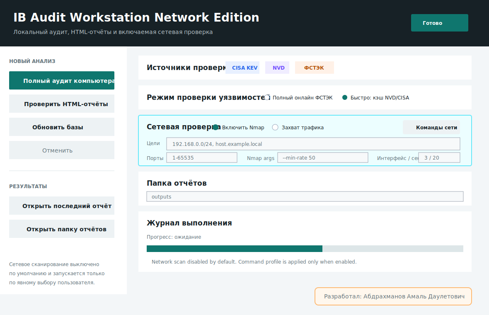
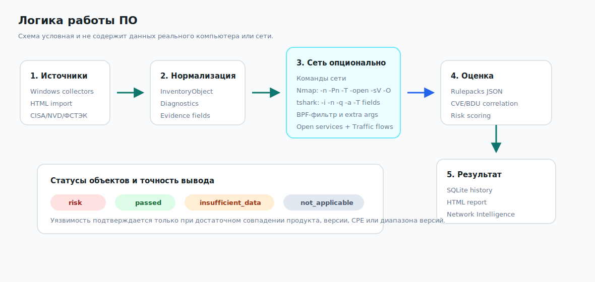
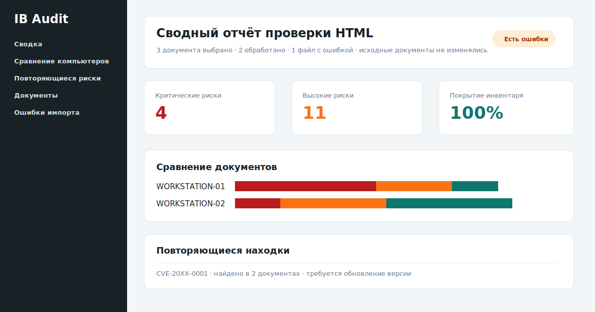
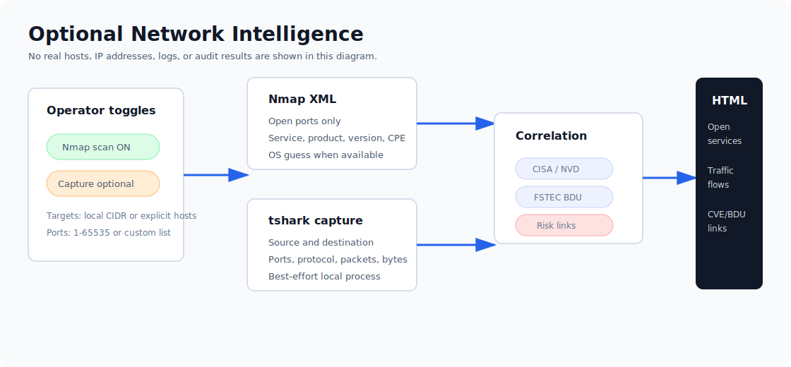
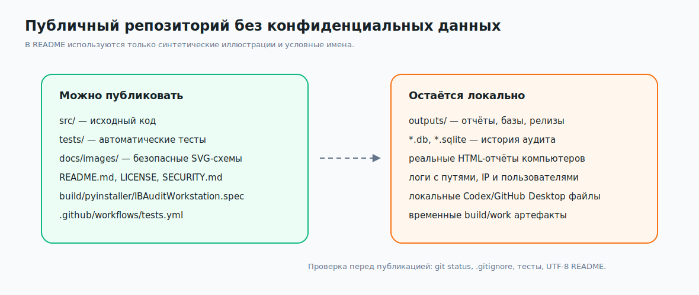

# IB Audit Workstation Network Edition

Локальная read-only рабочая станция для аудита Windows, анализа HTML-отчётов WinAudit/IB Audit Workstation, проверки известных уязвимостей по открытым источникам и опционального анализа сетевых коммуникаций через Nmap/tshark. Приложение не меняет настройки системы: оно собирает инвентаризацию, нормализует данные, применяет правила проверки, сопоставляет объекты с CISA KEV/NVD/ФСТЭК БДУ и формирует автономные HTML-отчёты.

Разработал: Абдрахманов Амаль Даулетович.

Версия без сетевого сканирования находится в отдельном репозитории: [Amtonsi/ib-audit-workstation](https://github.com/Amtonsi/ib-audit-workstation).

> Все картинки в README являются синтетическими схемами. В них нет реальных имён компьютеров, пользователей, IP-адресов, путей, журналов событий или результатов аудита.

[Скачать PDF-инструкцию с подробными схемами](docs/IBAuditWorkstation_UserGuide_RU.pdf)



## Что умеет приложение

- выполняет локальный аудит одной Windows-машины;
- импортирует один или несколько HTML-отчётов WinAudit/IB Audit Workstation;
- формирует один сводный HTML-отчёт по нескольким документам;
- показывает прогресс выполнения и позволяет отменить текущую проверку;
- опционально запускает полный анализ сети через Nmap и захват трафика через tshark/Wireshark;
- показывает в HTML-отчёте, какие приложения и сервисы с кем общаются, через какие порты и протоколы;
- проверяет настройки безопасности, службы, драйверы, автозапуск, задачи, пользователей, сетевые параметры, события, установленное ПО и другие категории инвентаризации;
- сопоставляет найденные объекты с CISA KEV, NVD CVE и ФСТЭК БДУ;
- хранит локальную историю аудитов в SQLite;
- генерирует автономные HTML-отчёты без внешних CSS/JS-ресурсов.

## Логика работы ПО



1. Пользователь запускает полный аудит компьютера или выбирает HTML-отчёты для проверки.
2. Коллекторы или HTML-импортёр превращают исходные данные в единый инвентарь объектов.
3. Диагностика фиксирует недоступные источники данных, ошибки парсинга и ограничения прав.
4. Rulepack применяет правила конфигурации и назначает каждому объекту статус:
   - `risk` — найден риск или нарушение;
   - `passed` — применимые правила пройдены;
   - `insufficient_data` — данных недостаточно для уверенного вывода;
   - `not_applicable` — к объекту нет применимых правил.
5. Если включён сетевой модуль, Nmap собирает открытые сервисы, а tshark фиксирует сетевые потоки за выбранный интервал.
6. Модуль уязвимостей сопоставляет ПО, драйверы, службы, сетевые сервисы и другие применимые объекты с CISA KEV, NVD и ФСТЭК БДУ.
7. Результат сохраняется в локальную SQLite-базу и в HTML-отчёт.
8. Если пользователь нажимает «Отменить», проверка останавливается в ближайшей безопасной точке. Для пакетного HTML-анализа уже обработанные документы могут попасть в частичный отчёт.

## Главное окно


Основные элементы интерфейса:

- «Полный аудит компьютера» запускает локальный сбор инвентаризации;
- «Проверить HTML-отчёты» открывает выбор одного или нескольких `.html`/`.htm` файлов;
- «Обновить базы» сначала ищет `vulnerability_sources.db` в папке проекта и подпапках, затем инкрементально обновляет найденную БД: переиспользует уже индексированные feed-файлы и активную CPE-генерацию, докачивая только актуальные или отсутствующие источники CISA/NVD/CPE;
- «Отменить» отправляет сигнал остановки активной операции;
- «Журнал выполнения» показывает текущий этап, прогресс и ошибки;
- нижняя подпись фиксирует автора приложения.

## Пакетная проверка HTML



Пакетный режим нужен, когда есть несколько отчётов с разных компьютеров. Приложение обрабатывает выбранные HTML-файлы последовательно, не изменяет исходные документы и создаёт один сводный отчёт.

Сводный отчёт показывает:

- общую статистику по выбранным документам;
- сравнение компьютеров по критическим и высоким рискам;
- повторяющиеся CVE/БДУ и нарушения конфигурации;
- ошибки отдельных входных файлов;
- полную детализацию по каждому обработанному документу.

## Сетевое сканирование и захват трафика



Сетевой модуль выключен по умолчанию. Его нужно включать только в сетях, где у пользователя есть разрешение на сканирование и захват трафика.

Что добавляет сетевой модуль:

- Nmap ищет открытые TCP/UDP-сервисы по выбранным целям и портам;
- из XML-вывода Nmap берутся только открытые порты, сервис, продукт, версия, CPE и ОС хоста, если они определены;
- tshark агрегирует трафик по направлениям: источник, назначение, протокол, порты, пакеты и байты;
- для локальных TCP-соединений приложение пытается привязать поток к процессу через `Get-NetTCPConnection`;
- сетевые сервисы участвуют в проверке уязвимостей наравне с ПО, службами и драйверами;
- HTML-отчёт получает раздел `Network Intelligence` с таблицами `Open services` и `Traffic flows`.

Требования для сетевого режима:

- установленный `nmap` и доступность команды `nmap` в `PATH`;
- установленный Wireshark/tshark и доступность команды `tshark` в `PATH`;
- запуск от администратора для более полного захвата трафика и определения сетевых сведений;
- разрешение на сканирование выбранного диапазона.

## Режимы проверки уязвимостей

| Режим | Что делает | Когда использовать |
|---|---|---|
| Полный онлайн ФСТЭК | Использует CISA KEV, NVD и онлайн-поиск ФСТЭК БДУ по применимым объектам | Для максимально полной проверки при наличии интернета |
| Быстро: кэш NVD/CISA | Использует локальные snapshots NVD/CISA без длительного онлайн-поиска ФСТЭК | Для быстрой проверки или работы в ограниченной сети |

Источники уязвимостей:

- [CISA Known Exploited Vulnerabilities Catalog](https://www.cisa.gov/known-exploited-vulnerabilities-catalog)
- [NVD Data Feeds](https://nvd.nist.gov/vuln/data-feeds)
- [NVD Vulnerabilities API](https://nvd.nist.gov/developers/vulnerabilities)
- [ФСТЭК БДУ](https://bdu.fstec.ru/vul)

Локальная `vulnerability_sources.db` хранит не только исходные CVE/KEV-записи, но и производные индексы NVD CPE: `a` для приложений, `o` для ОС/firmware и `h` для аппаратной части. Это позволяет проверять ПО, драйверы, BIOS, устройства, сетевые адаптеры, диски, процессоры и другие versioned-объекты без повторных запросов к NVD. При обновлении БД приложение сначала использует уже активную CPE-генерацию в SQLite; если её нет, скачивает официальный NVD CPE Dictionary, создаёт новую генерацию и активирует её только после успешной индексации. Большой CPE Match feed не скачивается по умолчанию; его можно включить явно через `--with-cpe-match`, если нужна максимально полная связь matchCriteriaId -> CPE. Поэтому отмена или сбой во время индексации не помечают неполную CPE-базу как рабочую. Для быстрых проверок используется FTS-индекс affected-products; при прерванной индексации база пересобирает производные таблицы при следующем обновлении.

Статус уязвимости строится не только по названию: приложение нормализует производителя, продукт, модель и версию, затем сопоставляет объект с CPE/NVD и проверяет диапазон версии. `Подтверждено` означает, что версия входит в уязвимый диапазон. `Потенциальный риск` используется для аппаратной части и прошивок, когда модель совпала, но в инвентаре не хватает версии BIOS/firmware/microcode для окончательного вывода.

HTML-отчёты показывают ссылки на источники CVE и отдельно помечают exploit-подобные ссылки бейджем `Эксплойт` для NVD reference URL вроде Exploit-DB, Metasploit, Packet Storm и SecurityFocus BID.

## Приватность и безопасная публикация



Приложение рассчитано на локальную обработку. В публичный репозиторий должны попадать только исходники, тесты, документация, безопасные схемы и скрипты сборки.

Не публикуйте:

- папку `outputs/`;
- HTML-отчёты реальных компьютеров;
- SQLite-базы с историей аудита;
- ZIP/EXE-релизы, если они содержат реальные результаты проверки;
- журналы выполнения с именами пользователей, компьютеров, IP-адресами или путями.

Эти артефакты исключены через `.gitignore`.

## Запуск из исходников

Требуется Windows и Python 3.11+.

```powershell
python run_app.py
```

CLI-аудит без автоматического открытия отчёта:

```powershell
python run_audit.py --no-open
python run_audit.py --offline --no-open
```

CLI-аудит с сетевым сканированием:

```powershell
python run_audit.py --network-scan --network-targets 192.168.1.0/24 --network-ports 1-65535 --no-open
```

CLI-аудит со сканированием и коротким захватом трафика:

```powershell
python run_audit.py --network-scan --network-capture --network-capture-duration 20 --no-open
```

Обновление локальной базы CISA/NVD. Скрипт сначала ищет существующую `vulnerability_sources.db` в папке проекта и подпапках; если БД найдена, она обновляется на месте, без полной перекачки уже индексированных исторических feed-файлов:

```powershell
python scripts/update_vulnerability_database.py --output outputs\vulnerability-database
```

По умолчанию скрипт также проверяет локальный CPE-индекс. Если активная CPE-генерация уже есть в SQLite, она переиспользуется без повторного скачивания больших архивов. Если CPE-индекса нет, будет скачан официальный `nvdcpe-2.0.tar.gz`; статистика покажет `CPE Dictionary` и `Active CPE generation`. Большой `nvdcpematch-2.0.tar.gz` включается отдельно:

```powershell
python scripts/update_vulnerability_database.py --output outputs\vulnerability-database --with-cpe-match
```

Для аварийного обновления только CVE/CISA можно временно отключить CPE:

```powershell
python scripts/update_vulnerability_database.py --output outputs\vulnerability-database --skip-cpe
```

## Сборка EXE

Используйте готовый `.spec`, потому что он добавляет rulepack-файлы `src/ib_audit/rulepacks/*.json` в `_internal/ib_audit/rulepacks`.

```powershell
python -m pip install pyinstaller
python -m PyInstaller build\pyinstaller\IBAuditWorkstation.spec --noconfirm --clean --distpath outputs\dist --workpath build\pyinstaller\work-batch-html
```

Не регенерируйте spec через `--name ... --specpath`: PyInstaller заменит список `datas`, и собранное приложение не сможет загрузить правила аудита.

## Сборка PDF и release ZIP

```powershell
python scripts\build_user_guide_pdf.py --output outputs\release\IBAuditWorkstation_UserGuide_RU.pdf
python scripts\build_release_package.py --output outputs\release\IBAuditWorkstation_release.zip
```

Release ZIP может включать EXE, локальные источники уязвимостей, PDF-инструкцию, MIT-лицензию и manifest с SHA-256. Публикуйте ZIP только как отдельный GitHub Release после проверки, что внутри нет конфиденциальных результатов аудита.

## Проверка качества

```powershell
python -m unittest discover -s tests
python -m compileall -q src run_app.py run_audit.py scripts
```

GitHub Actions также запускает тесты из `.github/workflows/tests.yml`.


## Лицензия

Проект распространяется по лицензии MIT.

Copyright (c) 2026 Абдрахманов Амаль Даулетович.
